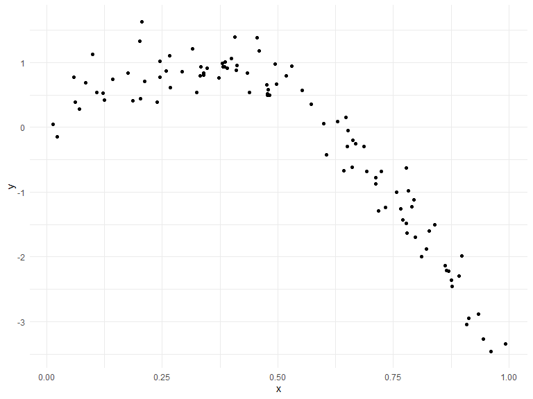
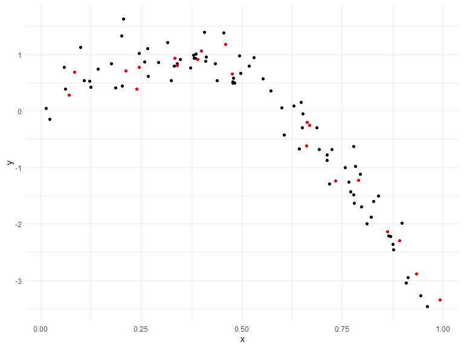
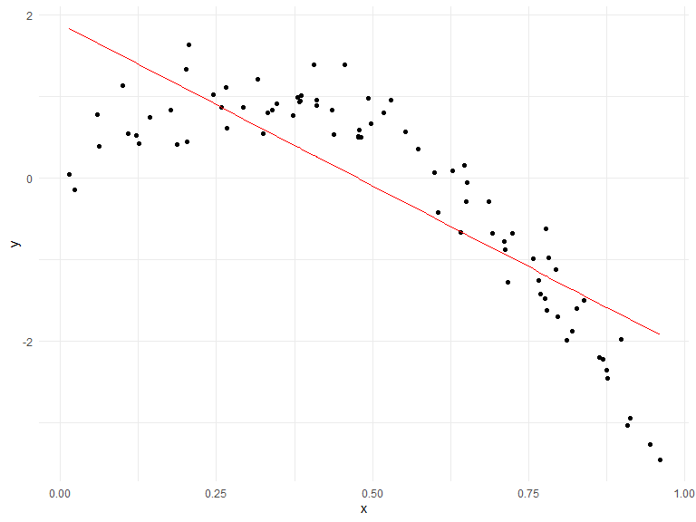
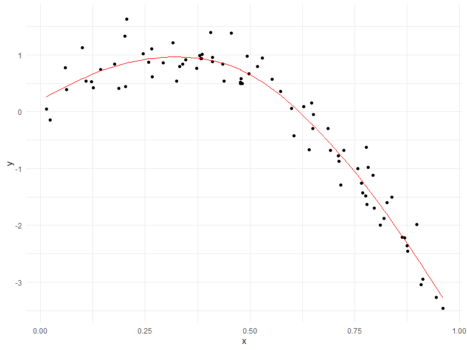
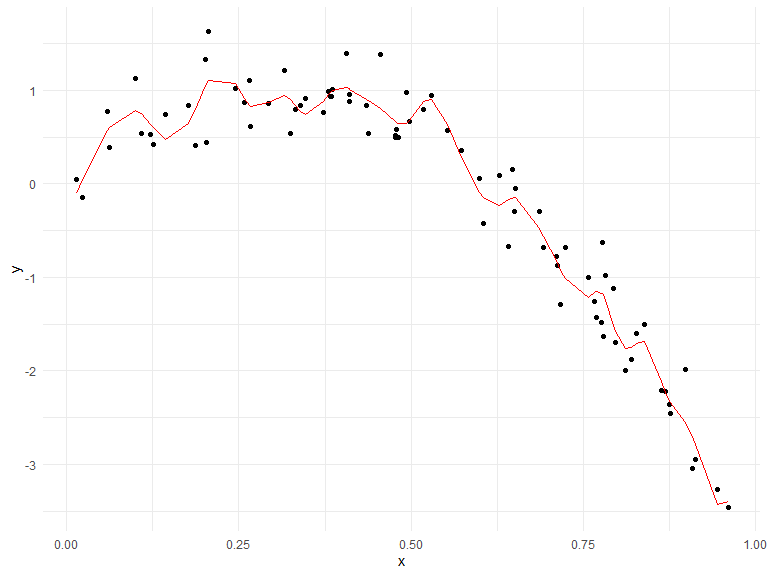
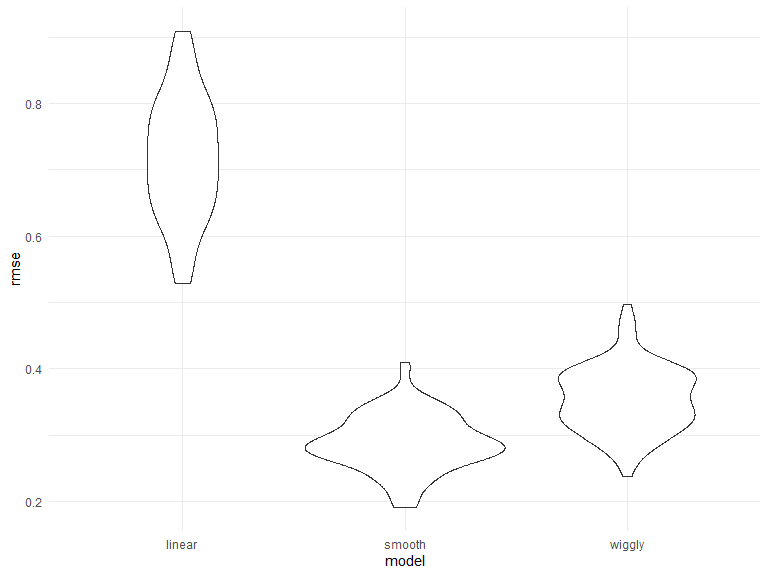
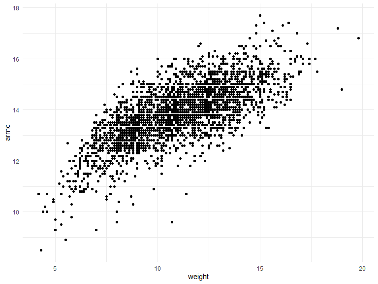
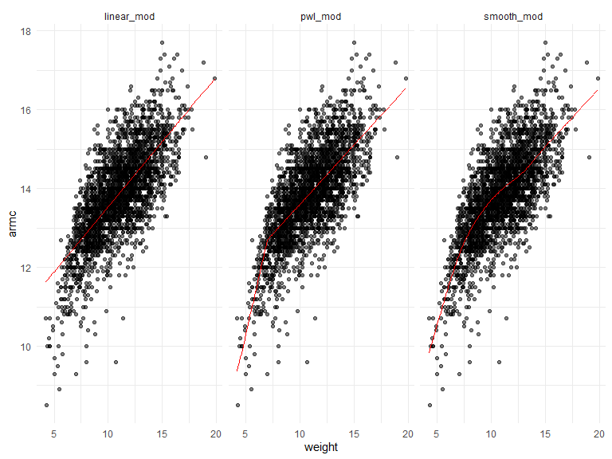
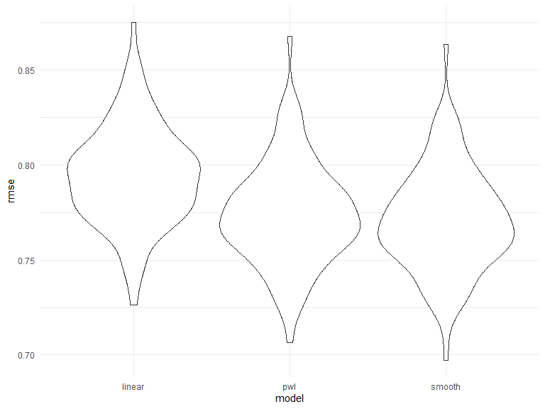

Cross Validation
================
Kristal Quispe
11/24/2019

## Cross validation

Generate a dataset

``` r
nonlin_df = 
  tibble(
    id = 1:100,
    x = runif(100, 0, 1),
    y = 1 - 10 * (x - .3) ^ 2 + rnorm(100, 0, .3)
  )
nonlin_df %>% 
  ggplot(aes(x = x, y = y)) + 
  geom_point()
```



Training and
testing.

``` r
train_df = sample_frac(nonlin_df, size = .8) # you have 80% of the orginal data sets

test_df = anti_join(nonlin_df, train_df, by = "id")#anti is give me everything in the nonlin data set that is not in the train data set
ggplot(train_df, aes(x = x, y = y)) + 
  geom_point() + 
  geom_point(data = test_df, color = "red")
```



``` r
#first plot teain and then plot test df and give them different colors. We are going to take the the black points (in train dataset) to fit your model and then seen how well the modelse make predictions about the red points(testing)
```

Fit three models of varying goodness.

``` r
linear_mod = lm(y ~ x, data = train_df)
#fit simple linear model
smooth_mod = mgcv::gam(y ~ s(x), data = train_df)
#fit a smooth fitting curve, y is a funcition of smooth x
wiggly_mod = mgcv::gam(y ~ s(x, k = 30), sp = 10e-6, data = train_df)
#fit with something too wiggly,y is a smooth function of x with extra arguments to make it not work. 
```

Let’s look at some fits.

``` r
train_df %>% 
  add_predictions(linear_mod) %>% 
  ggplot(aes(x = x, y = y)) + 
  geom_point() +
  geom_line(aes(y = pred), color = "red")
```



``` r
#simple line model is not a good fit
train_df %>% 
  add_predictions(smooth_mod) %>% 
  ggplot(aes(x = x, y = y)) + 
  geom_point() +
  geom_line(aes(y = pred), color = "red")
```



``` r
#smmoth model looks great
train_df %>% 
  add_predictions(wiggly_mod) %>% 
  ggplot(aes(x = x, y = y)) + 
  geom_point() +
  geom_line(aes(y = pred), color = "red")
```



``` r
#smmoth wiggle model is too wiggly, does better than linear regression but not best. 
#no p value to asses which model works best 
```

``` r
#here we are computing root mean squre error. Error for smoothmodel has the least error. aka best model. Here you are getting prediction error. You use rmse on test df not the train df, beucase you want to test on a furture data set/data you havent seen before. 
rmse(linear_mod, test_df)
```

    ## [1] 0.7052956

``` r
rmse(smooth_mod, test_df)
```

    ## [1] 0.2221774

``` r
rmse(wiggly_mod, test_df)
```

    ## [1] 0.289051

## Do this all using `modelr`

``` r
cv_df = 
  crossv_mc(nonlin_df, 100) 
#this takes in a data frame, and makes a test df and training df, this will generate 100 training testing pairs
#now we want to build a model in train and test it with testing. 
```

one note about resample …

``` r
cv_df %>% pull(train) %>% .[[3]] %>% as_tibble
```

    ## # A tibble: 79 x 3
    ##       id     x      y
    ##    <int> <dbl>  <dbl>
    ##  1     1 0.266  1.11 
    ##  2     2 0.372  0.764
    ##  3     3 0.573  0.358
    ##  4     4 0.908 -3.04 
    ##  5     5 0.202  1.33 
    ##  6     6 0.898 -1.99 
    ##  7     7 0.945 -3.27 
    ##  8    11 0.206  1.63 
    ##  9    12 0.177  0.836
    ## 10    13 0.687 -0.291
    ## # ... with 69 more rows

``` r
#use this to see each of the df on the 100, you are pulling each individual row, and look at them in a tibble
```

``` r
#here we get rid of the memeory helpfulness stuff
cv_df =
  cv_df %>% 
  mutate(
    train = map(train, as_tibble),# converting the tibble to data sets
    test = map(test, as_tibble)) #same converting
#changes how we store
```

Try fitting the linear model to all of these…

``` r
cv_results = 
  cv_df %>% 
  mutate(
    linear_mods = map(.x = train, ~lm(y ~ x, data = .x)),
    smooth_mods = map(.x = train, ~gam(y ~ s(x), data = .x)),
    wiggly_mod =  map(.x = train, ~gam(y ~ s(x, k = 30), sp = 10e-6, data = .x)),
    rmse_linear = map2_dbl(.x = linear_mods, .y = test, ~rmse(.x, .y)),
    rmse_smooth = map2_dbl(.x = smooth_mods, .y = test, ~rmse(.x, .y)),
    rmse_wiggly = map2_dbl(wiggly_mod, test, ~rmse(model = .x, data = .y))
  )
```

visualize this.

``` r
cv_results %>% 
  select(starts_with("rmse")) %>% 
  pivot_longer(
    everything(),
    names_to = "model", 
    values_to = "rmse",
    names_prefix = "rmse_") %>% 
  mutate(model = fct_inorder(model)) %>% 
  ggplot(aes(x = model, y = rmse)) + geom_violin()
```



## Child growth

``` r
child_growth = read_csv("./data/nepalese_children.csv")
```

    ## Parsed with column specification:
    ## cols(
    ##   age = col_double(),
    ##   sex = col_double(),
    ##   weight = col_double(),
    ##   height = col_double(),
    ##   armc = col_double()
    ## )

``` r
child_growth %>% 
  ggplot(aes(x = weight, y = armc)) + 
  geom_point()
```



Add change point term (instead of wiggle model)

``` r
child_growth =
  child_growth %>% 
  mutate(weight_cp = (weight > 7) * (weight - 7))
```

Fit models

``` r
linear_mod = lm(armc ~ weight, data = child_growth)
pwl_mod = lm(armc ~ weight + weight_cp, data = child_growth)
smooth_mod = gam(armc ~ s(weight), data = child_growth)
```

Make a plot

``` r
child_growth %>% 
  gather_predictions(linear_mod, pwl_mod, smooth_mod) %>% 
  mutate(model = fct_inorder(model)) %>% 
  ggplot(aes(x = weight, y = armc)) + 
  geom_point(alpha = .5) +
  geom_line(aes(y = pred), color = "red") + 
  facet_grid(~model)
```



Re-use my CV process – first get training / testing splits …

``` r
cv_df =
  crossv_mc(child_growth, 100) %>% 
  mutate(
    train = map(train, as_tibble),
    test = map(test, as_tibble))
```

… then fit models and get RMSEs.

``` r
cv_df = 
  cv_df %>% 
  mutate(linear_mod  = map(train, ~lm(armc ~ weight, data = .x)),
         pwl_mod     = map(train, ~lm(armc ~ weight + weight_cp, data = .x)),
         smooth_mod  = map(train, ~gam(armc ~ s(weight), data = as_tibble(.x)))) %>% 
  mutate(rmse_linear = map2_dbl(linear_mod, test, ~rmse(model = .x, data = .y)),
         rmse_pwl    = map2_dbl(pwl_mod, test, ~rmse(model = .x, data = .y)),
         rmse_smooth = map2_dbl(smooth_mod, test, ~rmse(model = .x, data = .y)))
```

Let’s make a plot of the results\!

``` r
cv_df %>% 
  select(starts_with("rmse")) %>% 
pivot_longer(
    everything(),
    names_to = "model", 
    values_to = "rmse",
    names_prefix = "rmse_") %>% 
  mutate(model = fct_inorder(model)) %>% 
  ggplot(aes(x = model, y = rmse)) + geom_violin()
```



So\! Which model is best here …? smmoth is better, but usually its the
pwl…
